## Introduce the project

- This is a clone project of [Mindset](https://www.getmindset.com/) by [Dive Studios](https://www.divestudios.io/) at Tamwood College.
- Cloning a project allows you to learn from real-world examples, improve problem-solving skills, build a portfolio, and gain practical experience with new technologies efficiently.
- Author: [daheeahn](https://github.com/daheeahn)

## What is Mindset

- Get Mindset is a platform that offers tools and resources to help individuals develop a growth mindset, improve mental resilience, and achieve personal and professional growth, featuring programs with celebrity mentors.

## Why I choose Mindset

- I chose this project because I am interested in K-pop, and it includes content led by K-pop celebrities. Additionally, the focus on mindset aligns with my belief in the importance of mental strength, which also influenced my decision.

## Core Focus: HTML & CSS Layout Design

- In this project, you can see how I applied the basics of HTML and CSS. It wasn't built to be responsive, as I focused primarily on creating the layout.
  - HTML5 Boilerplate
  - Multi-Page Navigation
  - Block/Inline/Inline-Block Elements
  - CSS Type/Class/Id Selectors
  - CSS Box Model
  - Basic CSS Properties
  - Pseudo-Classes & Links
  - Floats
  - Flexbox Container
  - Flexbox Items
  - Grid
- ✅You can also see the details of the CSS I used through [🔗this link(To be added)](). Please check it out!

## Project Structure

```
clone-mindset/
├── assets/        # Contains images, fonts, and other media assets
├── css/           # Contains CSS files for styling the website
├── pages/         # Directory for additional HTML pages
├── index.html     # The main HTML file for the website
└── README.md      # Documentation file with project information and instructions
```

# Preview

## 1) [Main Page](https://github.com/daheeahn/clone-mindset/blob/main/index.html)

- The Main page introduces the features of Mindset.
- You can access the other pages through the navigation at the top right.

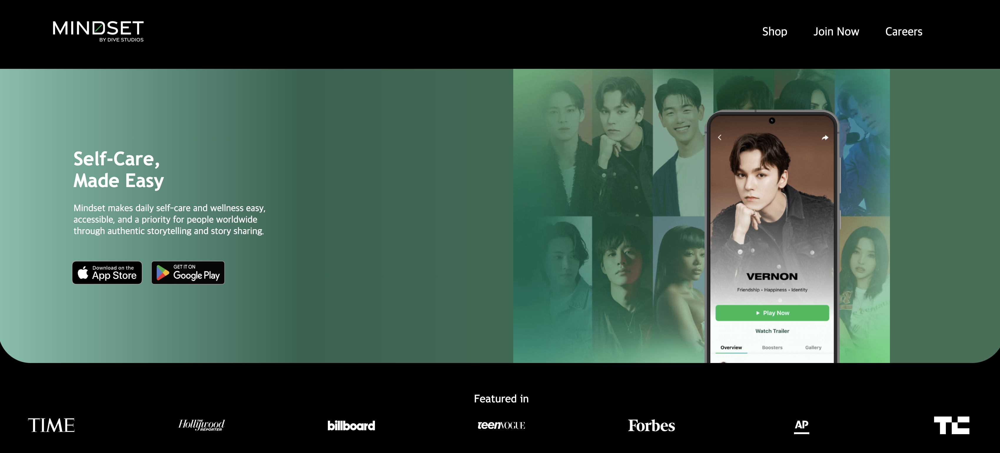
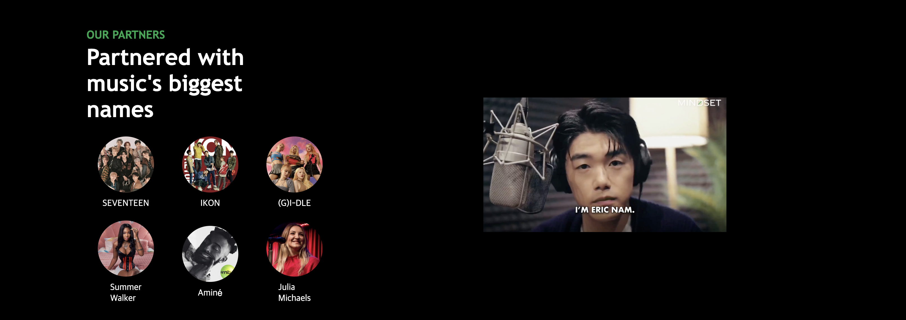
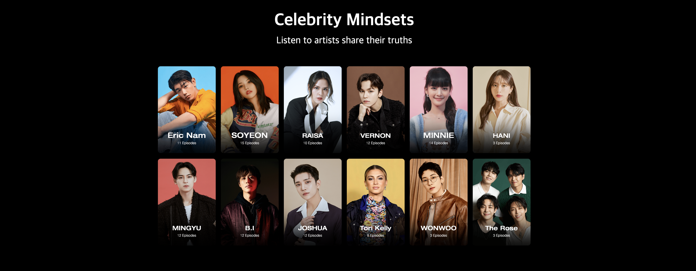
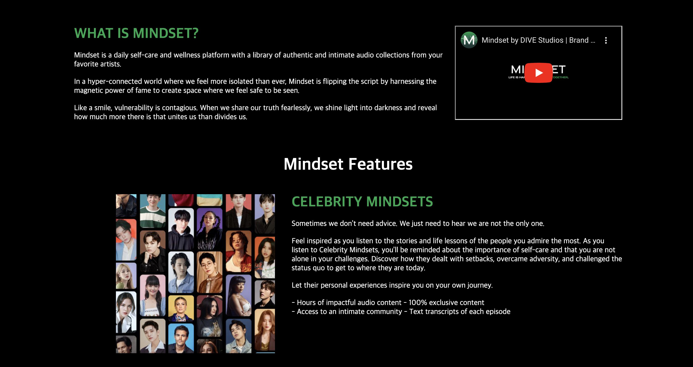
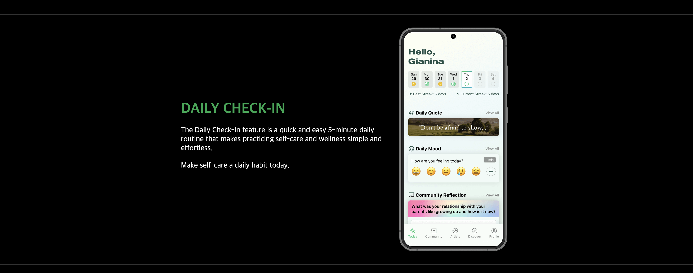
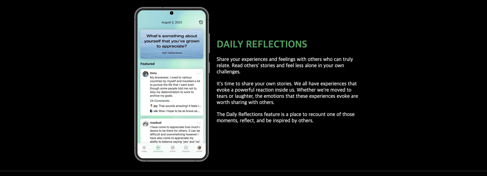
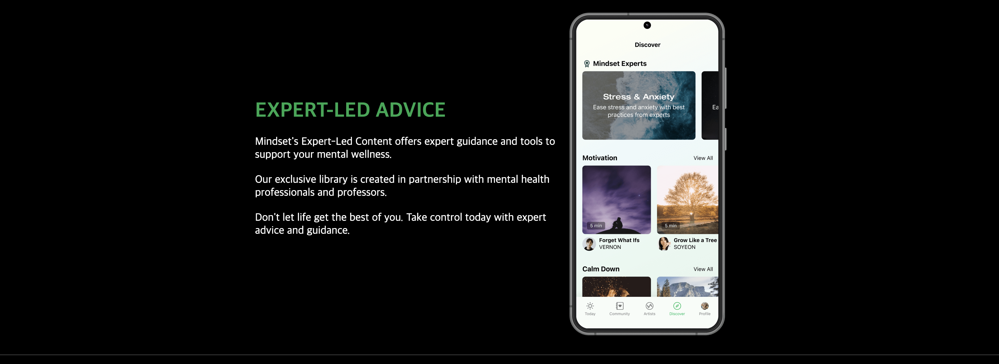
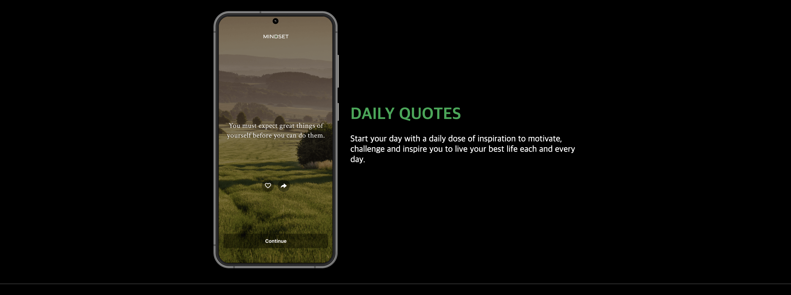
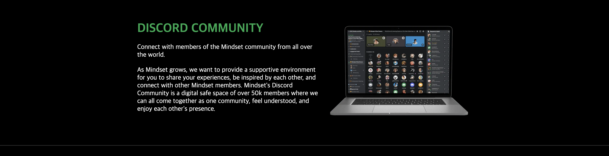
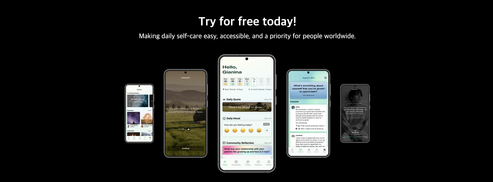
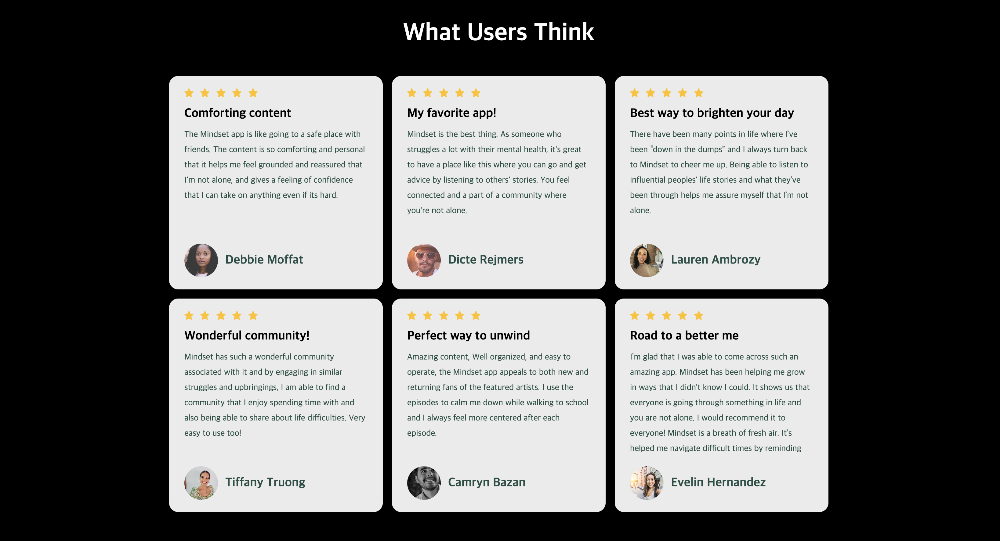
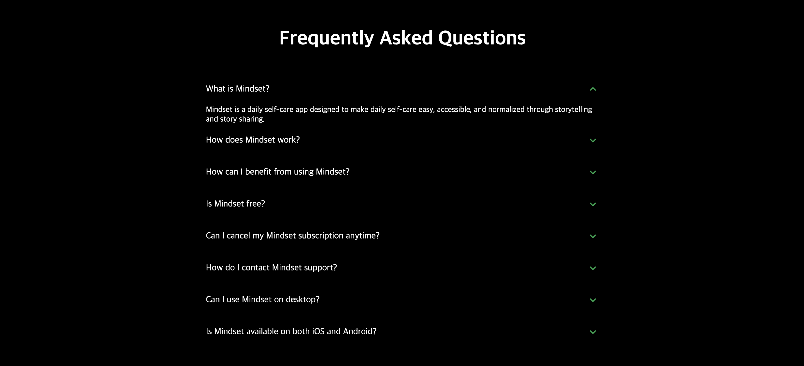
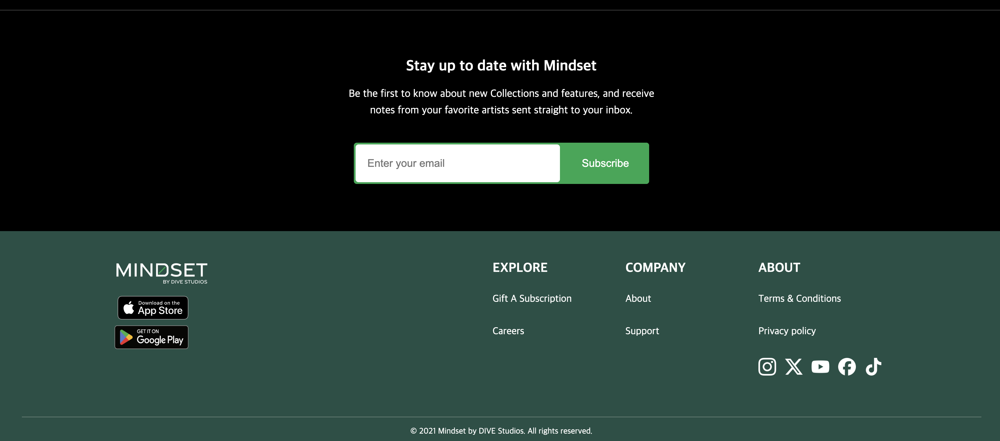

## 2) [Shop Page](https://github.com/daheeahn/clone-mindset/blob/main/pages/shop.html)

- The Shop page offers Dive Studios merchandise for sale.

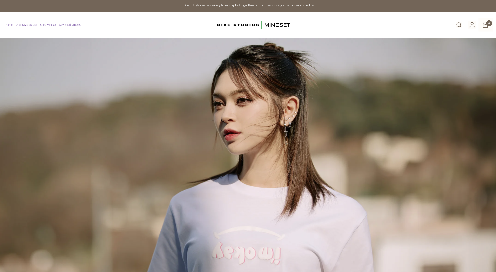
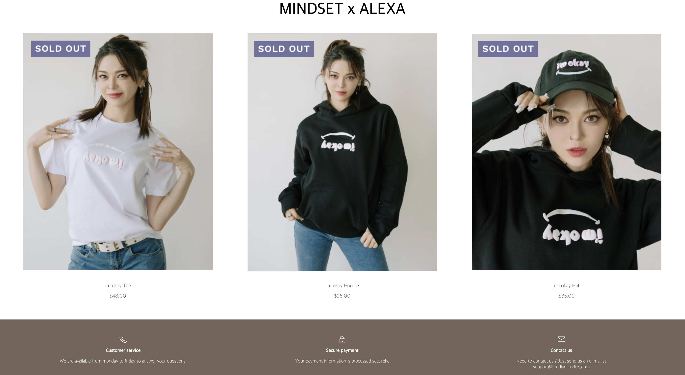

## 3) [Join Now Page](https://github.com/daheeahn/clone-mindset/blob/main/pages/join-now.html)

- The Join Now page highlights the membership features.

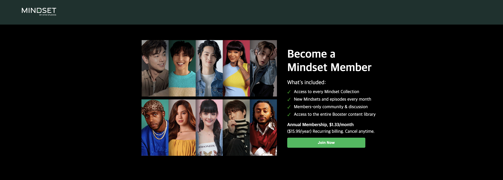

## 4) [Career Page](https://github.com/daheeahn/clone-mindset/blob/main/pages/career.html)

- The Career page introduces the talent pool of Dive Studios.

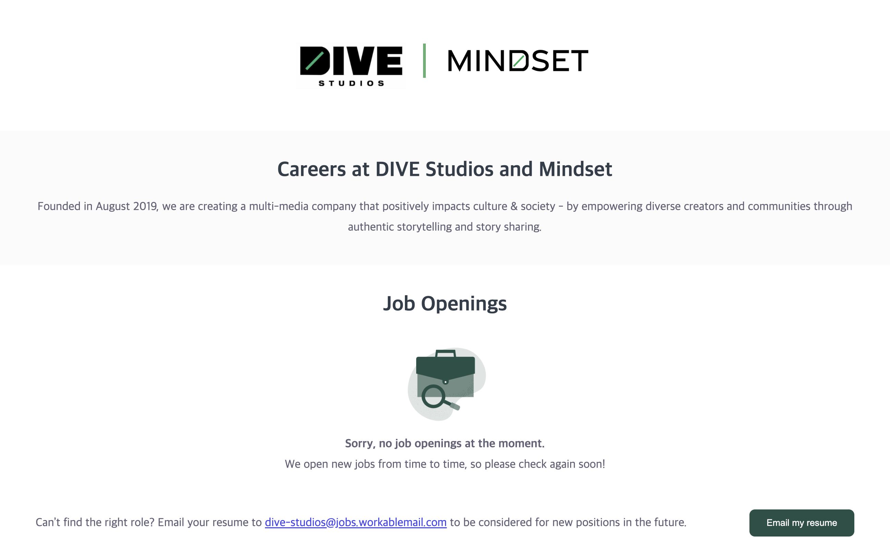
